# 分布式事务

# 0.课前准备

## 0.1.学习目标

- 了解分布式事务产生的原因
- 知道几种分布式事务解决方案：XA、TCC、消息事务、TA、SAGA
- 知道分布式事务各种解决方案的优缺点和使用场景
-  学会使用Seata来解决分布式事务


## 0.2.知识准备

- 会使用SpringBoot
- 会使用SpringCloud的Eureka和Feign组件
- 知道mysql的传统事务特性


# 1.什么是分布式事务

要了解分布式事务，必须先了解本地事务。

## 1.1.本地事务

本地事务，是指传统的单机数据库事务，必须具备ACID原则：

- **原子性（A）**

所谓的原子性就是说，在整个事务中的所有操作，要么全部完成，要么全部不做，没有中间状态。对于事务在执行中发生错误，所有的操作都会被回滚，整个事务就像从没被执行过一样。

 

- **一致性（C）**

事务的执行必须保证系统的一致性，在事务开始之前和事务结束以后，数据库的完整性没有被破坏，就拿转账为例，A有500元，B有500元，如果在一个事务里A成功转给B50元，那么不管发生什么，那么最后A账户和B账户的数据之和必须是1000元。

 

- **隔离性（I）**

所谓的隔离性就是说，事务与事务之间不会互相影响，一个事务的中间状态不会被其他事务感知。数据库保证隔离性包括四种不同的隔离级别：

​	Read Uncommitted（读取未提交内容）

​	Read Committed（读取提交内容）

​	Repeatable Read（可重读）

​	Serializable（可串行化）


- **持久性（D）**

所谓的持久性，就是说一旦事务提交了，那么事务对数据所做的变更就完全保存在了数据库中，即使发生停电，系统宕机也是如此。


因为在传统项目中，项目部署基本是单点式：即单个服务器和单个数据库。这种情况下，数据库本身的事务机制就能保证ACID的原则，这样的事务就是本地事务。

概括来讲，单个服务与单个数据库的架构中，产生的事务都是本地事务。


其中原子性和持久性就要靠undo和redo 日志来实现。

## 1.2.undo和redo

本小节参考内容：[mysqlops](http://www.zhdba.com/mysqlops/2012/04/06/innodb-log1/)

在数据库系统中，既有存放数据的文件，也有存放日志的文件。日志在内存中也是有缓存Log buffer，也有磁盘文件log file。

MySQL中的日志文件，有这么两种与事务有关：undo日志与redo日志。

### 1.2.1.undo日志

数据库事务具备原子性（**Atomicity**），如果事务执行失败，需要把数据回滚。

事务同时还具备持久性**(Durability)**，事务对数据所做的变更就完全保存在了数据库，不能因为故障而丢失。

原子性可以利用undo日志来实现。


Undo Log的原理很简单，为了满足事务的原子性，在操作任何数据之前，首先将数据备份到Undo Log。然后进行数据的修改。如果出现了错误或者用户执行了ROLLBACK语句，系统可以利用Undo Log中的备份将数据恢复到事务开始之前的状态。

数据库写入数据到磁盘之前，会把**数据先缓存在内存**中，事务提交时才会写入磁盘中。

用Undo Log实现原子性和持久化的事务的简化过程：

 假设有A、B两个数据，值分别为1,2。
 A. 事务开始.
 B. 记录A=1到undo log.
 C. 修改A=3.
 D. 记录B=2到undo log.
 E. 修改B=4.
 F. 将undo log写到磁盘。
 G. 将数据写到磁盘。
 H. 事务提交

- 如何保证持久性？

  事务提交前，会把修改数据到磁盘前，也就是说只要事务提交了，数据肯定持久化了。

- 如何保证原子性？

  - 每次对数据库修改，都会把修改前数据记录在undo log，那么需要回滚时，可以读取undo log，恢复数据。

  - 若系统在G和H之间崩溃

    此时事务并未提交，需要回滚。而undo log已经被持久化，可以根据undo log来恢复数据

  - 若系统在G之前崩溃

    此时数据并未持久化到硬盘，依然保持在事务之前的状态

**缺陷：**每个事务提交前将数据和Undo Log写入磁盘，这样会导致大量的磁盘IO，因此性能很低。

如果能够将数据缓存一段时间，就能减少IO提高性能。但是这样就会丧失事务的持久性。因此引入了另外一种机制来实现持久化，即**Redo Log**.


### 1.2.2.redo日志

和Undo Log相反，Redo Log记录的是**新数据**的备份。在事务提交前，只要将Redo Log持久化即可，不需要将数据持久化，减少了IO的次数。

先来看下基本原理：

> **Undo + Redo事务的简化过程**

 假设有A、B两个数据，值分别为1,2

 A. 事务开始.
 B. 记录A=1到undo log buffer.
 C. 修改A=3.
 D. 记录A=3到redo log buffer.
 E. 记录B=2到undo log buffer.
 F. 修改B=4.
 G. 记录B=4到redo log buffer.
 H. 将undo log写入磁盘
 I. 将redo log写入磁盘
 J. 事务提交


> 安全和性能问题

- 如何保证原子性？

  如果在事务提交前故障，通过undo log日志恢复数据。如果undo log都还没写入，那么数据就尚未持久化，无需回滚

- 如何保证持久化？

  大家会发现，这里并没有出现数据的持久化。因为数据已经写入redo log，而redo log持久化到了硬盘，因此只要到了步骤`I`以后，事务是可以提交的。

- 内存中的数据库数据何时持久化到磁盘？

  因为redo log已经持久化，因此数据库数据写入磁盘与否影响不大，不过为了避免出现脏数据（内存中与磁盘不一致），事务提交后也会将内存数据刷入磁盘（也可以按照固设定的频率刷新内存数据到磁盘中）。

- redo log何时写入磁盘

  redo log会在事务提交之前，或者redo log buffer满了的时候写入磁盘


这里存在两个问题：

问题1：之前是写undo和数据库数据到硬盘，现在是写undo和redo到磁盘，似乎没有减少IO次数
- 数据库数据写入是随机IO，性能很差
- redo log在初始化时会开辟一段连续的空间，写入是顺序IO，性能很好
- 实际上undo log并不是直接写入磁盘，而是先写入到redo log buffer中，当redo log持久化时，undo log就同时持久化到硬盘了。

因此事务提交前，只需要对redo log持久化即可。

另外，redo log并不是写入一次就持久化一次，redo log在内存中也有自己的缓冲池：`redo log buffer`。每次写redo log都是写入到buffer，在提交时一次性持久化到磁盘，减少IO次数。


问题2：redo log 数据是写入内存buffer中，当buffer满或者事务提交时，将buffer数据写入磁盘。

redo log中记录的数据，有可能包含尚未提交事务，如果此时数据库崩溃，那么如何完成数据恢复？

数据恢复有两种策略：

- 恢复时，只重做已经提交了的事务
- 恢复时，重做所有事务包括未提交的事务和回滚了的事务。然后通过Undo Log回滚那些未提交的事务

Inodb引擎采用的是第二种方案，因此undo log要在 redo log前持久化


### 1.2.3.总结

最后总结一下：

- undo log 记录更新前数据，用于保证事务原子性
- redo log 记录更新后数据，用于保证事务的持久性
- redo log有自己的内存buffer，先写入到buffer，事务提交时写入磁盘
- redo log持久化之后，意味着事务是**可提交**的

## 1.3.分布式事务

分布式事务，就是指不是在单个服务或单个数据库架构下，产生的事务：

- 跨数据源的分布式事务
- 跨服务的分布式事务
- 综合情况

### 1）跨数据源

随着业务数据规模的快速发展，数据量越来越大，单库单表逐渐成为瓶颈。所以我们对数据库进行了水平拆分，将原单库单表拆分成数据库分片，于是就产生了跨数据库事务问题。

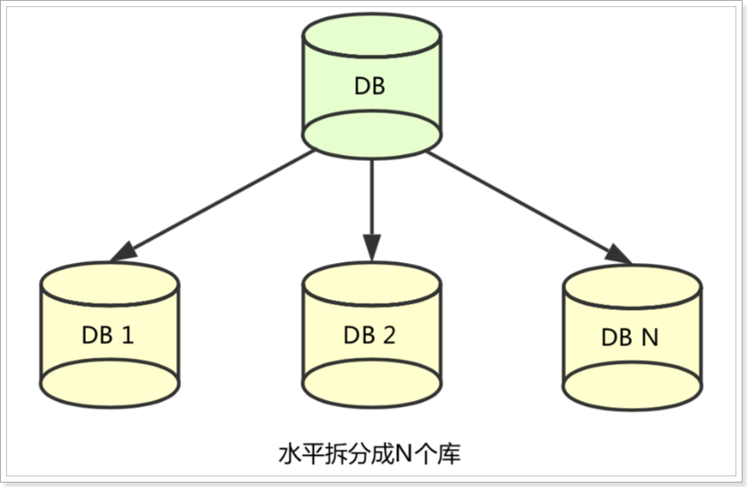

### 2）跨服务

在业务发展初期，“一块大饼”的单业务系统架构，能满足基本的业务需求。但是随着业务的快速发展，系统的访问量和业务复杂程度都在快速增长，单系统架构逐渐成为业务发展瓶颈，解决业务系统的高耦合、可伸缩问题的需求越来越强烈。

如下图所示，按照面向服务（SOA）的架构的设计原则，将单业务系统拆分成多个业务系统，降低了各系统之间的耦合度，使不同的业务系统专注于自身业务，更有利于业务的发展和系统容量的伸缩。

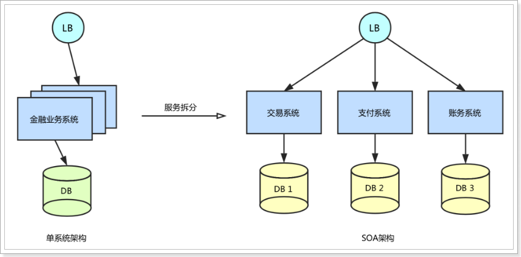


### 3）分布式系统的数据一致性问题

在数据库水平拆分、服务垂直拆分之后，一个业务操作通常要跨多个数据库、服务才能完成。在分布式网络环境下，我们无法保障所有服务、数据库都百分百可用，一定会出现部分服务、数据库执行成功，另一部分执行失败的问题。

当出现部分业务操作成功、部分业务操作失败时，业务数据就会出现不一致。

例如电商行业中比较常见的下单付款案例，包括下面几个行为：

- 创建新订单
- 扣减商品库存
- 从用户账户余额扣除金额

完成上面的操作需要访问三个不同的微服务和三个不同的数据库。

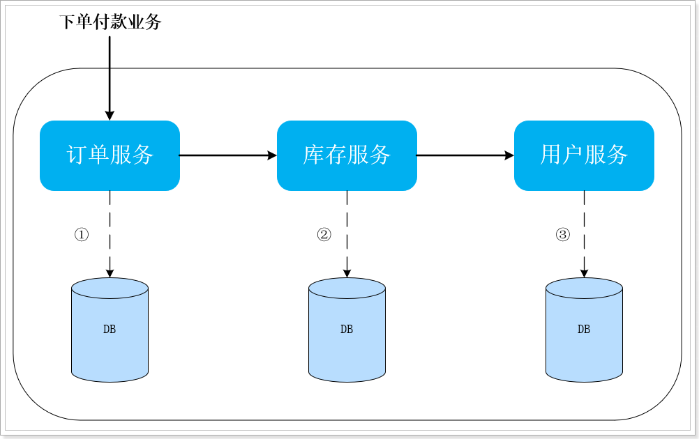

在分布式环境下，肯定会出现部分操作成功、部分操作失败的问题，比如：订单生成了，库存也扣减了，但是 用户账户的余额不足，这就造成数据不一致。

订单的创建、库存的扣减、账户扣款在每一个服务和数据库内是一个本地事务，可以保证ACID原则。

但是当我们把三件事情看做一个事情事，要满足保证“业务”的原子性，要么所有操作全部成功，要么全部失败，不允许出现部分成功部分失败的现象，这就是分布式系统下的事务了。

此时ACID难以满足，这是分布式事务要解决的问题


# 2.解决分布式事务的思路

为什么分布式系统下，事务的ACID原则难以满足？

这得从CAP定理和BASE理论说起。

## 2.1.CAP定理

本小节内容摘自：[CAP 定理的含义](https://www.ruanyifeng.com/blog/2018/07/cap.html)

什么是CAP定理呢？

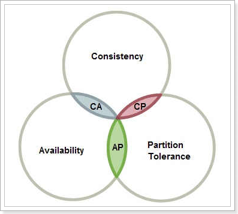 

1998年，加州大学的计算机科学家 Eric Brewer 提出，分布式系统有三个指标。

> - Consistency（一致性）
> - Availability（可用性）
> - Partition tolerance （分区容错性）

它们的第一个字母分别是 C、A、P。

Eric Brewer 说，这三个指标不可能同时做到。这个结论就叫做 CAP 定理。

### 2.1.1.Partition tolerance 

先看 Partition tolerance，中文叫做"分区容错"。

大多数分布式系统都分布在多个子网络。每个子网络就叫做一个区（partition）。分区容错的意思是，区间通信可能失败。比如，一台服务器放在上海，另一台服务器放在北京，这就是两个区，它们之间可能因网络问题无法通信。

如图：

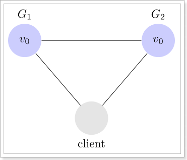 

上图中，G1 和 G2 是两台跨区的服务器。G1 向 G2 发送一条消息，G2 可能无法收到。系统设计的时候，必须考虑到这种情况。

一般来说，分布式系统，分区容错无法避免，因此可以认为 CAP 的 P 总是成立。根据CAP 定理，剩下的 C 和 A 无法同时做到。

### 2.1.2.Consistency

Consistency 中文叫做"一致性"。意思是，写操作之后的读操作，必须返回该值。举例来说，某条记录是 v0，用户向 G1 发起一个写操作，将其改为 v1。

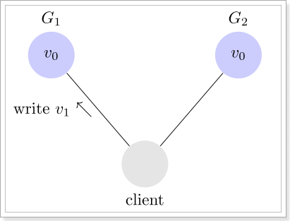 

接下来，用户的读操作就会得到 v1。这就叫一致性。

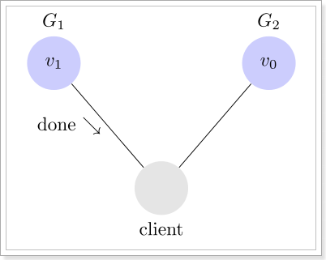 

问题是，用户有可能向 G2 发起读操作，由于 G2 的值没有发生变化，因此返回的是 v0。G1 和 G2 读操作的结果不一致，这就不满足一致性了。


为了让 G2 也能变为 v1，就要在 G1 写操作的时候，让 G1 向 G2 发送一条消息，要求 G2 也改成 v1。

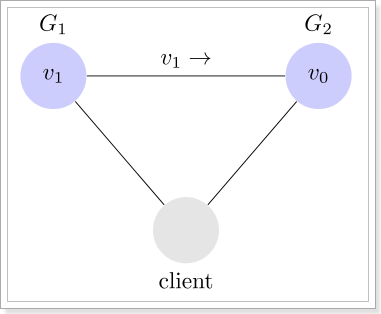 

这样的话，用户向 G2 发起读操作，也能得到 v1。

 

### 2.1.3.Availability 

 Availability 中文叫做"可用性"，意思是只要收到用户的请求，服务器就必须给出回应（对和错不论）。

用户可以选择向 G1 或 G2 发起读操作。不管是哪台服务器，只要收到请求，就必须告诉用户，到底是 v0 还是 v1，否则就不满足可用性。

### 2.1.4.Consistency 和 Availability 的矛盾

一致性和可用性，为什么不可能同时成立？

答案很简单，因为可能通信失败（即出现分区容错）。

如果保证 G2 的一致性，那么 G1 必须在写操作时，锁定 G2 的读操作和写操作。只有数据同步后，才能重新开放读写。锁定期间，G2 不能读写，没有可用性不。

如果保证 G2 的可用性，那么势必不能锁定 G2，所以一致性不成立。

综上所述，G2 无法同时做到一致性和可用性。系统设计时只能选择一个目标。如果追求一致性，那么无法保证所有节点的可用性；如果追求所有节点的可用性，那就没法做到一致性。


### 2.1.5.几点疑问

- 怎样才能同时满足CA？

  除非是单点架构

- 何时要满足CP？

  对一致性要求高的场景。例如我们的Zookeeper就是这样的，在服务节点间数据同步时，服务对外不可用。

- 何时满足AP？

  对可用性要求较高的场景。例如Eureka，必须保证注册中心随时可用，不然拉取不到服务就可能出问题。


## 2.2.Base理论

BASE是三个单词的缩写：

- Basically Available（基本可用）

- Soft state（软状态）
- Eventually consistent（最终一致性）


而我们解决分布式事务，就是根据上述理论来实现。

还以上面的下单减库存和扣款为例：

订单服务、库存服务、用户服务及他们对应的数据库就是分布式应用中的三个部分。

- CP方式：现在如果要满足事务的强一致性，就必须在订单服务数据库锁定的同时，对库存服务、用户服务数据资源同时锁定。等待三个服务业务全部处理完成，才可以释放资源。此时如果有其他请求想要操作被锁定的资源就会被阻塞，这样就是满足了CP。

  这就是强一致，弱可用

- AP方式：三个服务的对应数据库各自独立执行自己的业务，执行本地事务，不要求互相锁定资源。但是这个中间状态下，我们去访问数据库，可能遇到数据不一致的情况，不过我们需要做一些后补措施，保证在经过一段时间后，数据最终满足一致性。

  这就是高可用，但弱一致（最终一致）。

由上面的两种思想，延伸出了很多的分布式事务解决方案：

- XA
- TCC
- 可靠消息最终一致
- AT


## 2.4.分阶段提交

### 2.4.1DTP和XA

分布式事务的解决手段之一，就是两阶段提交协议（2PC：Two-Phase Commit）

那么到底什么是两阶段提交协议呢？

1994 年，X/Open 组织（即现在的 Open Group ）定义了分布式事务处理的DTP 模型。该模型包括这样几个角色：

- 应用程序（ AP ）：我们的微服务
- 事务管理器（ TM ）：全局事务管理者
- 资源管理器（ RM ）：一般是数据库
- 通信资源管理器（ CRM ）：是TM和RM间的通信中间件

在该模型中，一个分布式事务（全局事务）可以被拆分成许多个本地事务，运行在不同的AP和RM上。每个本地事务的ACID很好实现，但是全局事务必须保证其中包含的每一个本地事务都能同时成功，若有一个本地事务失败，则所有其它事务都必须回滚。但问题是，本地事务处理过程中，并不知道其它事务的运行状态。因此，就需要通过CRM来通知各个本地事务，同步事务执行的状态。

因此，各个本地事务的通信必须有统一的标准，否则不同数据库间就无法通信。**XA**就是 X/Open DTP中通信中间件与TM间联系的**接口规范**，定义了用于通知事务开始、提交、终止、回滚等接口，各个数据库厂商都必须实现这些接口。


### 2.4.2.二阶段提交

参考：[漫话分布式系统共识协议: 2PC/3PC篇](https://zhuanlan.zhihu.com/p/35298019)

**二阶提交协议**就是根据这一思想衍生出来的，将全局事务拆分为两个阶段来执行：

- 阶段一：准备阶段，各个本地事务完成本地事务的准备工作。
- 阶段二：执行阶段，各个本地事务根据上一阶段执行结果，进行提交或回滚。

这个过程中需要一个协调者（coordinator），还有事务的参与者（voter）。

> 1）正常情况

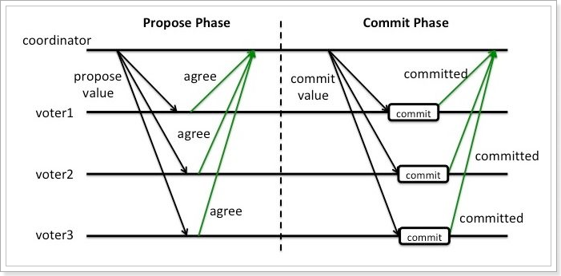 

**投票阶段**：协调组询问各个事务参与者，是否可以执行事务。每个事务参与者执行事务，写入redo和undo日志，然后反馈事务执行成功的信息（`agree`）

**提交阶段**：协调组发现每个参与者都可以执行事务（`agree`），于是向各个事务参与者发出`commit`指令，各个事务参与者提交事务。


> 2）异常情况

当然，也有异常的时候：

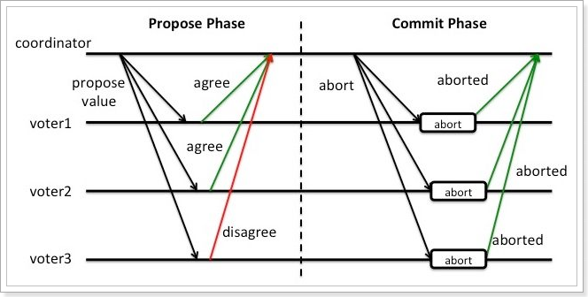 

**投票阶段**：协调组询问各个事务参与者，是否可以执行事务。每个事务参与者执行事务，写入redo和undo日志，然后反馈事务执行结果，但只要有一个参与者返回的是`Disagree`，则说明执行失败。

**提交阶段**：协调组发现有一个或多个参与者返回的是`Disagree`，认为执行失败。于是向各个事务参与者发出`abort`指令，各个事务参与者回滚事务。


> 3）缺陷

二阶段提交的问题：

- 单点故障问题

  2PC的缺点在于不能处理fail-stop形式的节点failure. 比如下图这种情况.

  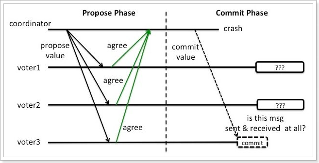 

  假设coordinator和voter3都在Commit这个阶段crash了, 而voter1和voter2没有收到commit消息. 这时候voter1和voter2就陷入了一个困境. 因为他们并不能判断现在是两个场景中的哪一种:

   (1)上轮全票通过然后voter3第一个收到了commit的消息并在commit操作之后crash了

   (2)上轮voter3反对所以干脆没有通过.

- 阻塞问题

  在准备阶段、提交阶段，每个事物参与者都会锁定本地资源，并等待其它事务的执行结果，阻塞时间较长，资源锁定时间太久，因此执行的效率就比较低了。


面对二阶段提交的上述缺点，后来又演变出了三阶段提交，但是依然没有完全解决阻塞和资源锁定的问题，而且引入了一些新的问题，因此实际使用的场景较少。


### 2.4.3.使用场景

对事务有强一致性要求，对事务执行效率不敏感，并且不希望有太多代码侵入。


## 2.5.TCC

TCC模式可以解决2PC中的资源锁定和阻塞问题，减少资源锁定时间。

### 2.5.1.基本原理

它本质是一种补偿的思路。事务运行过程包括三个方法，

- Try：资源的检测和预留；
- Confirm：执行的业务操作提交；要求 Try 成功 Confirm 一定要能成功；
- Cancel：预留资源释放。

执行分两个阶段：

- 准备阶段（try）：资源的检测和预留；
- 执行阶段（confirm/cancel）：根据上一步结果，判断下面的执行方法。如果上一步中所有事务参与者都成功，则这里执行confirm。反之，执行cancel

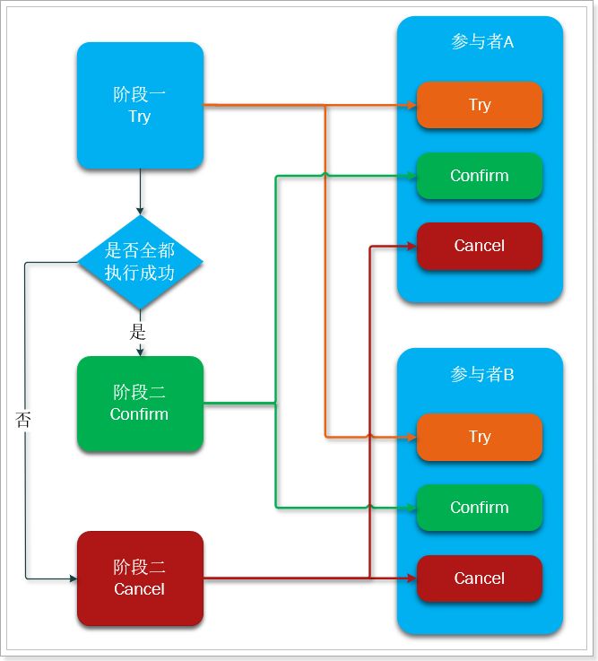 


粗看似乎与两阶段提交没什么区别，但其实差别很大：

- try、confirm、cancel都是独立的事务，不受其它参与者的影响，不会阻塞等待它人
- try、confirm、cancel由程序员在业务层编写，锁粒度有代码控制


### 2.5.2.实例

我们以之前的下单业务中的扣减余额为例来看下三个不同的方法要怎么编写，假设账户A原来余额是100，需要余额扣减30元。如图：

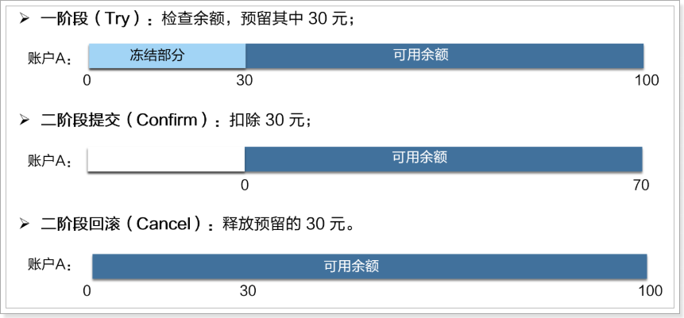

- 一阶段（Try）：余额检查，并冻结用户部分金额，此阶段执行完毕，事务已经提交
  - 检查用户余额是否充足，如果充足，冻结部分余额
  - 在账户表中添加冻结金额字段，值为30，余额不变

- 二阶段
  - 提交（Confirm）：真正的扣款，把冻结金额从余额中扣除，冻结金额清空
    - 修改冻结金额为0，修改余额为100-30 = 70元
  - 补偿（Cancel）：释放之前冻结的金额，并非回滚
    - 余额不变，修改账户冻结金额为0

### 2.5.3.优势和缺点

- 优势

  TCC执行的每一个阶段都会提交本地事务并释放锁，并不需要等待其它事务的执行结果。而如果其它事务执行失败，最后不是回滚，而是执行补偿操作。这样就避免了资源的长期锁定和阻塞等待，执行效率比较高，属于性能比较好的分布式事务方式。

- 缺点
  - 代码侵入：需要人为编写代码实现try、confirm、cancel，代码侵入较多
  - 开发成本高：一个业务需要拆分成3个步骤，分别编写业务实现，业务编写比较复杂
  - 安全性考虑：cancel动作如果执行失败，资源就无法释放，需要引入重试机制，而重试可能导致重复执行，还要考虑重试时的幂等问题


### 2.5.4.使用场景

- 对事务有一定的一致性要求（最终一致）
- 对性能要求较高
- 开发人员具备较高的编码能力和幂等处理经验


## 2.6.可靠消息服务

这种实现方式的思路，其实是源于ebay，其基本的设计思想是将远程分布式事务拆分成一系列的本地事务。

### 2.6.1.基本原理

一般分为事务的发起者A和事务的其它参与者B：

- 事务发起者A执行本地事务
- 事务发起者A通过MQ将需要执行的事务信息发送给事务参与者B
- 事务参与者B接收到消息后执行本地事务

如图：

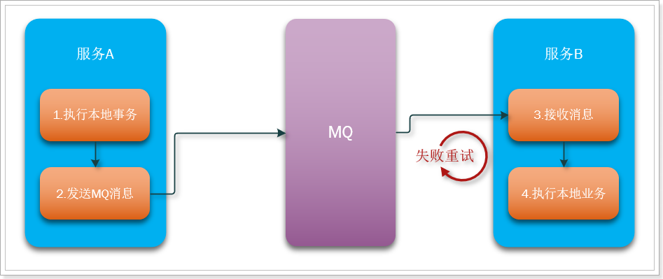

这个过程有点像你去学校食堂吃饭：

- 拿着钱去收银处，点一份红烧牛肉面，付钱
- 收银处给你发一个小票，还有一个号牌，你别把票弄丢！
- 你凭小票和号牌一定能领到一份红烧牛肉面，不管需要多久


几个注意事项：

- 事务发起者A必须确保本地事务成功后，消息一定发送成功
- MQ必须保证消息正确投递和持久化保存
- 事务参与者B必须确保消息最终一定能消费，如果失败需要多次重试
- 事务B执行失败，会重试，但不会导致事务A回滚


那么问题来了，我们如何保证消息发送一定成功？如何保证消费者一定能收到消息？


### 2.6.2.本地消息表

为了避免消息发送失败或丢失，我们可以把消息持久化到数据库中。实现时有简化版本和解耦合版本两种方式。

#### 1）简化版本

原理图：

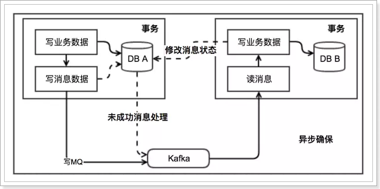 

- 事务发起者：
  - 开启本地事务
  - 执行事务相关业务
  - 发送消息到MQ
  - 把消息持久化到数据库，标记为已发送
  - 提交本地事务

- 事务接收者：
  - 接收消息
  - 开启本地事务
  - 处理事务相关业务
  - 修改数据库消息状态为已消费
  - 提交本地事务

- 额外的定时任务
  - 定时扫描表中超时未消费消息，重新发送


**优点：**

- 与tcc相比，实现方式较为简单，开发成本低。

**缺点：**

- 数据一致性完全依赖于消息服务，因此消息服务必须是可靠的。

- 需要处理被动业务方的幂等问题

- 被动业务失败不会导致主动业务的回滚，而是重试被动的业务

- **事务业务与消息发送业务耦合**、业务数据与消息表要在一起


#### 2）独立消息服务

为了解决上述问题，我们会引入一个独立的消息服务，来完成对消息的持久化、发送、确认、失败重试等一系列行为，大概的模型如下：

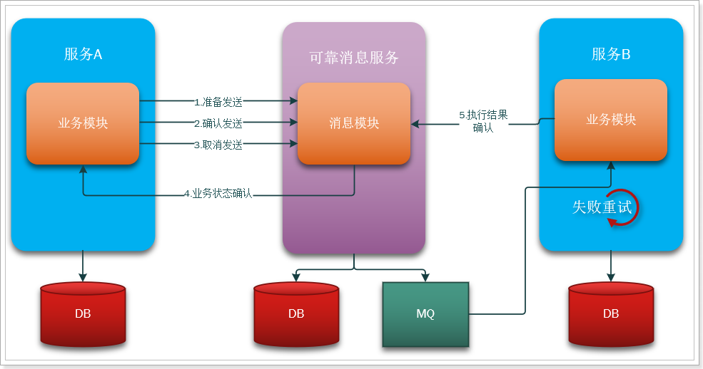


一次消息发送的时序图：

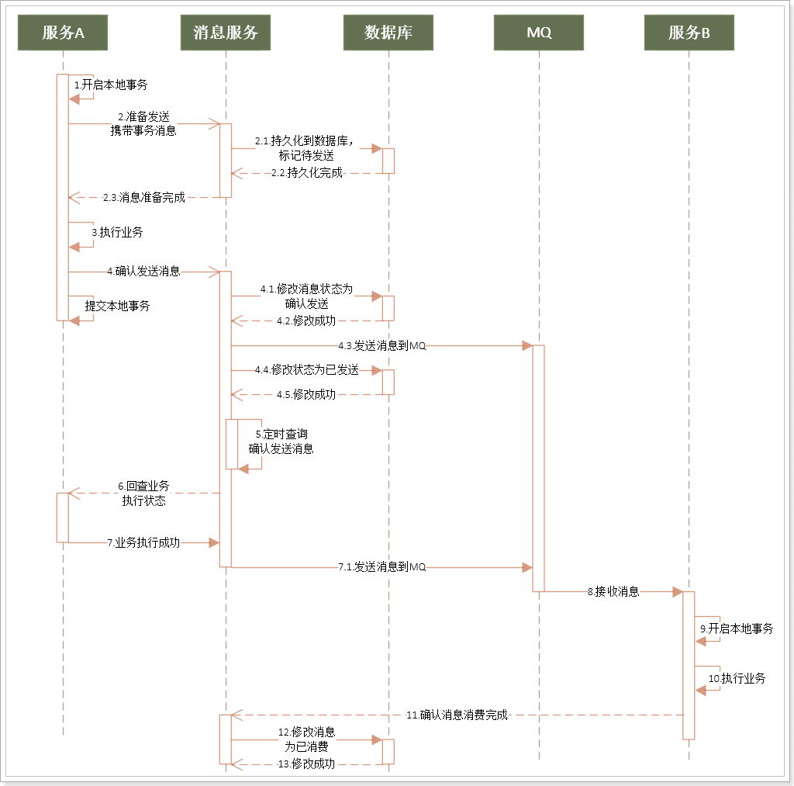


事务发起者A的基本执行步骤：

- 开启本地事务
- 通知消息服务，准备发送消息（消息服务将消息持久化，标记为准备发送）
- 执行本地业务，
  - 执行失败则终止，通知消息服务，取消发送（消息服务修改订单状态）
  - 执行成功则继续，通知消息服务，确认发送（消息服务发送消息、修改订单状态）
- 提交本地事务

消息服务本身提供下面的接口：

- 准备发送：把消息持久化到数据库，并标记状态为准备发送
- 取消发送：把数据库消息状态修改为取消
- 确认发送：把数据库消息状态修改为确认发送。尝试发送消息，成功后修改状态为已发送
- 确认消费：消费者已经接收并处理消息，把数据库消息状态修改为已消费
- 定时任务：定时扫描数据库中状态为确认发送的消息，然后询问对应的事务发起者，事务业务执行是否成功，结果：
  - 业务执行成功：尝试发送消息，成功后修改状态为已发送
  - 业务执行失败：把数据库消息状态修改为取消

事务参与者B的基本步骤：

- 接收消息
- 开启本地事务
- 执行业务
- 通知消息服务，消息已经接收和处理
- 提交事务


**优点：**

- 解除了事务业务与消息相关业务的耦合

**缺点：**

- 实现起来比较复杂


### 2.6.3.RocketMQ事务消息

RocketMQ本身自带了事务消息，可以保证消息的可靠性，原理其实就是自带了本地消息表，与我们上面讲的思路类似。


### 2.6.4.RabbitMQ的消息确认

RabbitMQ确保消息不丢失的思路比较奇特，并没有使用传统的本地表，而是利用了消息的确认机制：

- 生产者确认机制：确保消息从生产者到达MQ不会有问题
  - 消息生产者发送消息到RabbitMQ时，可以设置一个异步的监听器，监听来自MQ的ACK
  - MQ接收到消息后，会返回一个回执给生产者：
    - 消息到达交换机后路由失败，会返回失败ACK
    - 消息路由成功，持久化失败，会返回失败ACK
    - 消息路由成功，持久化成功，会返回成功ACK
  - 生产者提前编写好不同回执的处理方式
    - 失败回执：等待一定时间后重新发送
    - 成功回执：记录日志等行为
- 消费者确认机制：确保消息能够被消费者正确消费
  - 消费者需要在监听队列的时候指定手动ACK模式
  - RabbitMQ把消息投递给消费者后，会等待消费者ACK，接收到ACK后才删除消息，如果没有接收到ACK消息会一直保留在服务端，如果消费者断开连接或异常后，消息会投递给其它消费者。
  - 消费者处理完消息，提交事务后，手动ACK。如果执行过程中抛出异常，则不会ACK，业务处理失败，等待下一条消息

经过上面的两种确认机制，可以确保从消息生产者到消费者的消息安全，再结合生产者和消费者两端的本地事务，即可保证一个分布式事务的最终一致性。


### 2.6.5.消息事务的优缺点

总结上面的几种模型，消息事务的优缺点如下：

- 优点：
  - 业务相对简单，不需要编写三个阶段业务
  - 是多个本地事务的结合，因此资源锁定周期短，性能好
- 缺点：
  - 代码侵入
  - 依赖于MQ的可靠性
  - 消息发起者可以回滚，但是消息参与者无法引起事务回滚
  - 事务时效性差，取决于MQ消息发送是否及时，还有消息参与者的执行情况

针对事务无法回滚的问题，有人提出说可以再事务参与者执行失败后，再次利用MQ通知消息服务，然后由消息服务通知其他参与者回滚。那么，恭喜你，你利用MQ和自定义的消息服务再次实现了2PC 模型，又造了一个大轮子


## 2.7.AT模式

2019年 1 月份，Seata 开源了 AT 模式。AT 模式是一种无侵入的分布式事务解决方案。可以看做是对TCC或者二阶段提交模型的一种优化，解决了TCC模式中的代码侵入、编码复杂等问题。

在 AT 模式下，用户只需关注自己的“业务 SQL”，用户的 “业务 SQL” 作为一阶段，Seata 框架会自动生成事务的二阶段提交和回滚操作。

可以参考Seata的[官方文档](https://seata.io/zh-cn/docs/dev/mode/at-mode.html)。

### 2.7.1.基本原理

先来看一张流程图：

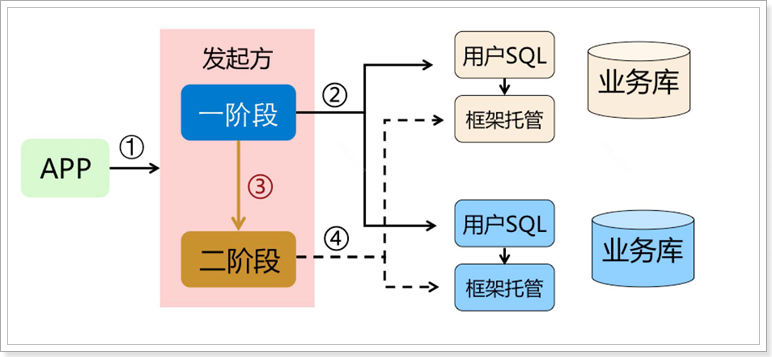

有没有感觉跟TCC的执行很像，都是分两个阶段：

- 一阶段：执行本地事务，并返回执行结果
- 二阶段：根据一阶段的结果，判断二阶段做法：提交或回滚

但AT模式底层做的事情可完全不同，而且第二阶段根本不需要我们编写，全部有Seata自己实现了。也就是说：我们写的**代码与本地事务时代码一样**，无需手动处理分布式事务。

那么，AT模式如何实现无代码侵入，如何帮我们自动实现二阶段代码的呢？


> 一阶段

在一阶段，Seata 会拦截“业务 SQL”，首先解析 SQL 语义，找到“`业务 SQL`”要更新的业务数据，在业务数据被更新前，将其保存成“`before image`”，然后执行“`业务 SQL`”更新业务数据，在业务数据更新之后，再将其保存成“`after image`”，最后获取全局行锁，**提交事务**。以上操作全部在一个数据库事务内完成，这样保证了一阶段操作的原子性。

这里的`before image`和`after image`类似于数据库的undo和redo日志，但其实是用数据库模拟的。

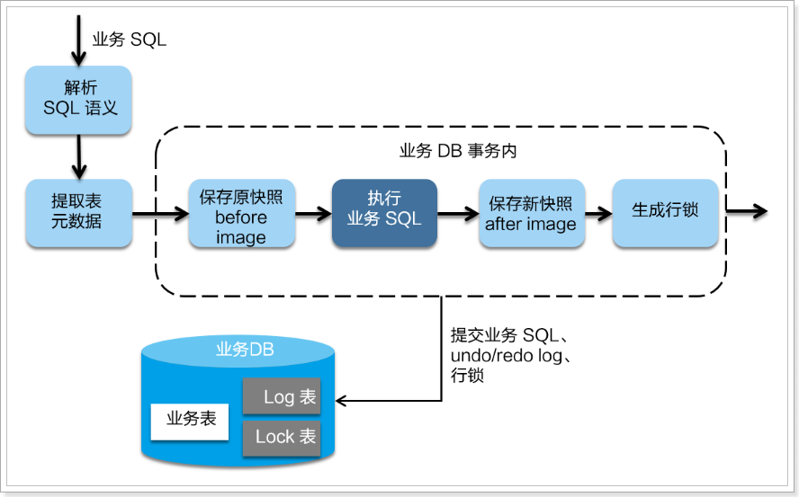

> 二阶段提交

二阶段如果是提交的话，因为“`业务 SQL`”在一阶段已经提交至数据库， 所以 Seata 框架只需将一阶段保存的快照数据和行锁删掉，完成数据清理即可。


> 二阶段回滚：

二阶段如果是回滚的话，Seata 就需要回滚一阶段已经执行的“`业务 SQL`”，还原业务数据。回滚方式便是用“`before image`”还原业务数据；但在还原前要首先要校验脏写，对比“数据库当前业务数据”和 “`after image`”，如果两份数据完全一致就说明没有脏写，可以还原业务数据，如果不一致就说明有`脏写`，出现脏写就需要转人工处理。

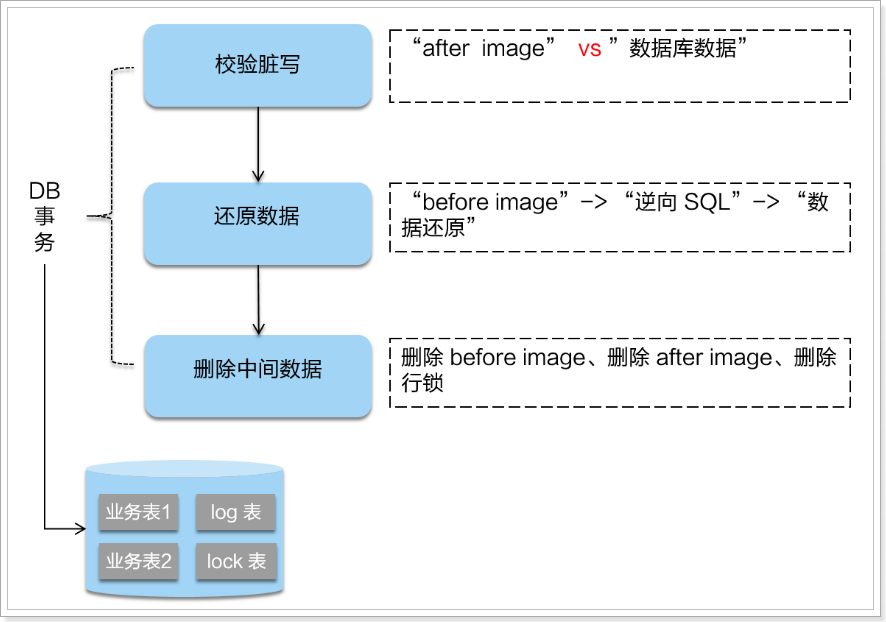

不过因为有全局锁机制，所以可以降低出现`脏写`的概率。

AT 模式的一阶段、二阶段提交和回滚均由 Seata 框架自动生成，用户只需编写“业务 SQL”，便能轻松接入分布式事务，AT 模式是一种对业务无任何侵入的分布式事务解决方案。


### 2.7.2.详细架构和流程

Seata中的几个基本概念：

- TC（Transaction Coordinator） - 事务协调者

  维护全局和分支事务的状态，驱动全局事务提交或回滚（TM之间的协调者）。

- TM（Transaction Manager） - 事务管理器

  定义全局事务的范围：开始全局事务、提交或回滚全局事务。

- RM（Resource Manager） - 资源管理器

  管理分支事务处理的资源，与TC交谈以注册分支事务和报告分支事务的状态，并驱动分支事务提交或回滚。

我们看下面的一个架构图

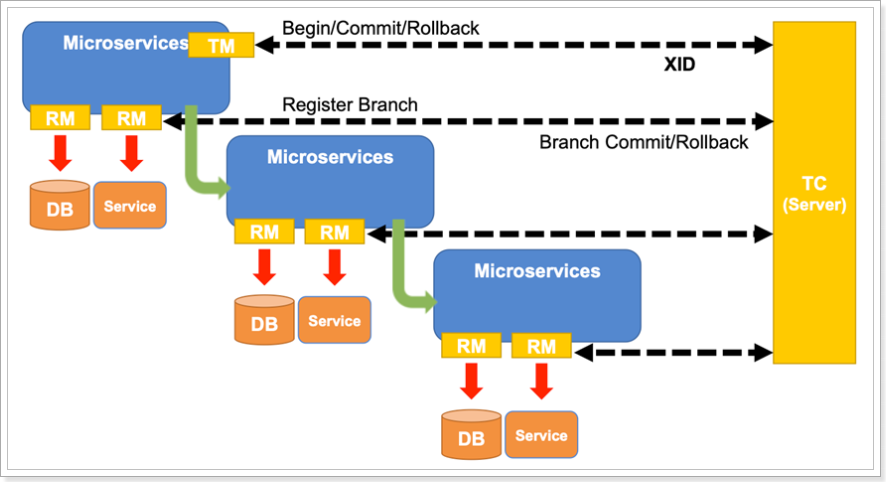

- TM：业务模块中全局事务的开启者
  - 向TC开启一个全局事务
  - 调用其它微服务
- RM：业务模块执行者中，包含RM部分，负责向TC汇报事务执行状态
  - 执行本地事务
  - 向TC注册分支事务，并提交本地事务执行结果
- TM：结束对微服务的调用，通知TC，全局事务执行完毕，事务一阶段结束
- TC：汇总各个分支事务执行结果，决定分布式事务是提交还是回滚；
- TC 通知所有 RM 提交/回滚 资源，事务二阶段结束。


一阶段：

- TM开启全局事务，并向TC声明全局事务，包括全局事务XID信息
- TM所在服务调用其它微服务
- 微服务，主要有RM来执行
  - 查询`before_image`
  - 执行本地事务
  - 查询`after_image`
  - 生成`undo_log`并写入数据库
  - 向TC注册分支事务，告知事务执行结果
  - 获取全局锁（阻止其它全局事务并发修改当前数据）
  - 释放本地锁（不影响其它业务对数据的操作）
- 待所有业务执行完毕，事务发起者（TM）会尝试向TC提交全局事务

二阶段：

- TC统计分支事务执行情况，根据结果判断下一步行为
  - 分支都成功：通知分支事务，提交事务
  - 有分支执行失败：通知执行成功的分支事务，回滚数据
- 分支事务的RM
  - 提交事务：直接清空`before_image`和`after_image`信息，释放全局锁
  - 回滚事务：
    - 校验after_image，判断是否有脏写
    - 如果没有脏写，回滚数据到`before_image`，清除`before_image`和`after_image`
    - 如果有脏写，请求人工介入


### 2.7.3.工作机制

详见Seata的官方文档：https://seata.io/zh-cn/docs/overview/what-is-seata.html

> #### 场景

以一个示例来说明整个 AT 分支的工作过程。

业务表：`product`

| Field | Type         | Key  |
| ----- | ------------ | ---- |
| id    | bigint(20)   | PRI  |
| name  | varchar(100) |      |
| since | varchar(100) |      |

AT 分支事务的业务逻辑：

```sql
update product set name = 'GTS' where name = 'TXC';
```

> #### 一阶段

过程：

1. 解析 SQL：得到 SQL 的类型（UPDATE），表（product），条件（where name = 'TXC'）等相关的信息。
2. 查询前镜像：根据解析得到的条件信息，生成查询语句，定位数据。

```sql
select id, name, since from product where name = 'TXC';
```

得到前镜像：

| id   | name | since |
| ---- | ---- | ----- |
| 1    | TXC  | 2014  |

1. 执行业务 SQL：更新这条记录的 name 为 'GTS'。
2. 查询后镜像：根据前镜像的结果，通过 **主键** 定位数据。

```sql
select id, name, since from product where id = 1`;
```

得到后镜像：

| id   | name | since |
| ---- | ---- | ----- |
| 1    | GTS  | 2014  |

1. 插入回滚日志：把前后镜像数据以及业务 SQL 相关的信息组成一条回滚日志记录，插入到 `UNDO_LOG` 表中。

```json
{
	"branchId": 641789253,
	"undoItems": [{
		"afterImage": {
			"rows": [{
				"fields": [{
					"name": "id",
					"type": 4,
					"value": 1
				}, {
					"name": "name",
					"type": 12,
					"value": "GTS"
				}, {
					"name": "since",
					"type": 12,
					"value": "2014"
				}]
			}],
			"tableName": "product"
		},
		"beforeImage": {
			"rows": [{
				"fields": [{
					"name": "id",
					"type": 4,
					"value": 1
				}, {
					"name": "name",
					"type": 12,
					"value": "TXC"
				}, {
					"name": "since",
					"type": 12,
					"value": "2014"
				}]
			}],
			"tableName": "product"
		},
		"sqlType": "UPDATE"
	}],
	"xid": "xid:xxx"
}
```

1. 提交前，向 TC 注册分支：申请 `product` 表中，主键值等于 1 的记录的 **全局锁** 。
2. 本地事务提交：业务数据的更新和前面步骤中生成的 UNDO LOG 一并提交。
3. 将本地事务提交的结果上报给 TC。

> #### 二阶段-回滚

1. 收到 TC 的分支回滚请求，开启一个本地事务，执行如下操作。
2. 通过 XID 和 Branch ID 查找到相应的 UNDO LOG 记录。
3. 数据校验：拿 UNDO LOG 中的后镜与当前数据进行比较，如果有不同，说明数据被当前全局事务之外的动作做了修改。这种情况，需要根据配置策略来做处理，详细的说明在另外的文档中介绍。
4. 根据 UNDO LOG 中的前镜像和业务 SQL 的相关信息生成并执行回滚的语句：

```sql
update product set name = 'TXC' where id = 1;
```

1. 提交本地事务。并把本地事务的执行结果（即分支事务回滚的结果）上报给 TC。

> #### 二阶段-提交

1. 收到 TC 的分支提交请求，把请求放入一个异步任务的队列中，马上返回提交成功的结果给 TC。
2. 异步任务阶段的分支提交请求将异步和批量地删除相应 UNDO LOG 记录。


### 2.7.4.优缺点

优点：

- 与2PC相比：每个分支事务都是独立提交，不互相等待，减少了资源锁定和阻塞时间
- 与TCC相比：二阶段的执行操作全部自动化生成，无代码侵入，开发成本低

缺点：

- 与TCC相比，需要动态生成二阶段的反向补偿操作，执行性能略低于TCC


## 2.8.Saga模式

Saga 模式是 Seata 即将开源的长事务解决方案，将由蚂蚁金服主要贡献。

其理论基础是Hector & Kenneth  在1987年发表的论文[Sagas](https://microservices.io/patterns/data/saga.html)。

Seata官网对于Saga的指南：https://seata.io/zh-cn/docs/user/saga.html

### 基本模型

在 Saga 模式下，分布式事务内有多个参与者，每一个参与者都是一个冲正补偿服务，需要用户根据业务场景实现其正向操作和逆向回滚操作。

分布式事务执行过程中，依次执行各参与者的正向操作，如果所有正向操作均执行成功，那么分布式事务提交。如果任何一个正向操作执行失败，那么分布式事务会去退回去执行前面各参与者的逆向回滚操作，回滚已提交的参与者，使分布式事务回到初始状态。

 

Saga 模式下分布式事务通常是由事件驱动的，各个参与者之间是异步执行的，Saga 模式是一种长事务解决方案。


### 适用场景：

- 业务流程长、业务流程多
- 参与者包含其它公司或遗留系统服务，无法提供 TCC 模式要求的三个接口

### 优势：

- 一阶段提交本地事务，无锁，高性能
- 事件驱动架构，参与者可异步执行，高吞吐
- 补偿服务易于实现

### 缺点：

- 不保证隔离性（应对方案见[用户文档](https://seata.io/zh-cn/docs/user/saga.html)）


# 3.Seata

## 3.1.介绍

Seata（Simple Extensible Autonomous Transaction Architecture，简单可扩展自治事务框架）是 2019 年 1 月份蚂蚁金服和阿里巴巴共同开源的分布式事务解决方案。Seata 开源半年左右，目前已经有接近一万 star，社区非常活跃。我们热忱欢迎大家参与到 Seata 社区建设中，一同将 Seata 打造成开源分布式事务标杆产品。

Seata：[https://](https://github.com/seata/seata)[github.com/seata/seata](https://github.com/seata/seata)


### 3.1.1. Seata 产品模块

如下图所示，Seata 中有三大模块，分别是 TM、RM 和 TC。 其中 TM 和 RM 是作为 Seata 的客户端与业务系统集成在一起，TC 作为 Seata 的服务端独立部署。


### 3.1.2.Seata支持的事务模型

Seata 会有 4 种分布式事务解决方案，分别是 AT 模式、TCC 模式、Saga 模式和 XA 模式。 

## 3.2.AT模式实战

Seata中比较常用的是AT模式，这里我们拿AT模式来做演示，看看如何在SpringCloud微服务中集成Seata.

我们假定一个用户购买商品的业务逻辑。整个业务逻辑由3个微服务提供支持：

- 仓储服务：对给定的商品扣除仓储数量。
- 订单服务：根据采购需求创建订单。
- 帐户服务：从用户帐户中扣除余额。

流程图：


订单服务在下单时，同时调用库存服务和用户服务，此时就会发生跨服务和跨数据源的分布式事务问题。


### 3.2.1.准备数据

执行资料中提供的`seata_demo.sql`文件，导入数据。

其中包含4张表。

Order表：

```mysql
CREATE TABLE `order_tbl` (
  `id` int(11) NOT NULL AUTO_INCREMENT,
  `user_id` varchar(255) DEFAULT NULL COMMENT '用户id',
  `commodity_code` varchar(255) DEFAULT NULL COMMENT '商品码',
  `count` int(11) unsigned DEFAULT '0' COMMENT '购买数量',
  `money` int(11) unsigned DEFAULT '0' COMMENT '总金额',
  PRIMARY KEY (`id`) USING BTREE
) ENGINE=InnoDB DEFAULT CHARSET=utf8 ROW_FORMAT=COMPACT;
```

商品库存表：

```mysql
CREATE TABLE `storage_tbl` (
  `id` int(11) NOT NULL AUTO_INCREMENT,
  `commodity_code` varchar(255) DEFAULT NULL COMMENT '商品码',
  `count` int(11) unsigned DEFAULT '0' COMMENT '商品库存',
  PRIMARY KEY (`id`) USING BTREE,
  UNIQUE KEY `commodity_code` (`commodity_code`) USING BTREE
) ENGINE=InnoDB AUTO_INCREMENT=2 DEFAULT CHARSET=utf8 ROW_FORMAT=COMPACT;
```

用户账户表：

```mysql
CREATE TABLE `account_tbl` (
  `id` int(11) NOT NULL AUTO_INCREMENT,
  `user_id` varchar(255) DEFAULT NULL COMMENT '用户id',
  `money` int(11) unsigned DEFAULT '0' COMMENT '用户余额',
  PRIMARY KEY (`id`) USING BTREE
) ENGINE=InnoDB AUTO_INCREMENT=2 DEFAULT CHARSET=utf8 ROW_FORMAT=COMPACT;
```

还有用来记录Seata中的事务日志表undo_log，其中会包含`after_image`和`before_image`数据，用于数据回滚：

```mysql
CREATE TABLE `undo_log` (
  `id` bigint(20) NOT NULL AUTO_INCREMENT,
  `branch_id` bigint(20) NOT NULL,
  `xid` varchar(100) NOT NULL,
  `context` varchar(128) NOT NULL,
  `rollback_info` longblob NOT NULL,
  `log_status` int(11) NOT NULL,
  `log_created` datetime NOT NULL,
  `log_modified` datetime NOT NULL,
  `ext` varchar(100) DEFAULT NULL,
  PRIMARY KEY (`id`) USING BTREE,
  UNIQUE KEY `ux_undo_log` (`xid`,`branch_id`) USING BTREE
) ENGINE=InnoDB DEFAULT CHARSET=utf8 ROW_FORMAT=COMPACT;
```


### 3.2.2.引入Demo工程

我们先准备基本的项目环境，实现下单的业务代码

#### 导入项目

使用Idea打开资料中提供的 seata-demo项目：

 

找到项目所在目录，选中并打开：

 

项目结构如下：

 

结构说明：

- account-service：用户服务，提供操作用户账号余额的功能，端口8083
- eureka-server：注册中心，端口8761
- order-service：订单服务，提供根据数据创建订单的功能，端口8082
- storage-service：仓储服务，提供扣减商品库存功能，端口8081


#### 测试事务

接下来，我们来测试下分布式事务的现象。

下单的接口是：

- 请求方式：POST
- 请求路径：/order
- 请求参数：form表单，包括：
  - userId：用户id
  - commodityCode：商品码
  - count：购买数量
  - money：话费金额
- 返回值类型：long，订单的id

原始数据库数据：

余额：

 

库存：

 

其它两张表为空。


> 正常下单

此时启动项目，尝试下单，目前商品库存为10，用户余额为1000，因此只要数据不超过这两个值应该能正常下单。

 

查看数据库数据：

余额：

 

库存：

 

订单：

 


> 异常下单

这次，我们把money参数设置为1200，这样就超过了余额最大值，理论上所有数据都应该回滚：

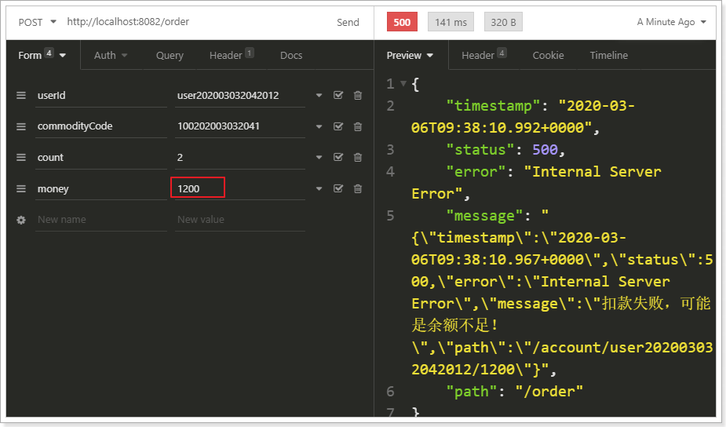

看下用户余额：

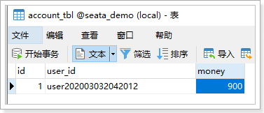 

因为扣款失败，因此这里没有扣减

来看下库存数据：

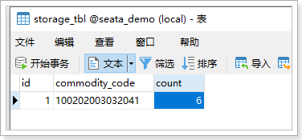 

这说明扣减库存依然成功，并未回滚！


接下来，我们引入Seata，看看能不能解决这个问题。


### 3.2.3.准备TC服务

在之前讲解Seata原理的时候，我们就聊过，其中包含重要的3个角色：

- TC：事务协调器
- TM：事务管理器
- RM：资源管理器

其中，TC是一个独立的服务，负责协调各个分支事务，而TM和RM通过jar包的方式，集成在各个事务参与者中。

因此，首先我们需要搭建一个独立的TC服务。

#### 1）安装

首先去官网下载TC的服务端安装包，GitHub的地址：https://github.com/seata/seata/releases

这里我们在资料中提供给大家1.1.0版本的安装包：

 


然后解压即可，其目录结构如下：

 

包括：

- bin：启动脚本
- conf：配置文件
- lib：依赖项
- 

#### 2）配置

Seata的核心配置主要是两部分：

- 注册中心的配置：在`${seata_home}/conf/`目录中，一般是`registry.conf`文件
- 当前服务的配置，两种配置方式：
  - 通过分布式服务的统一配置中心，例如Zookeeper
  - 通过本地文件

我们先看registry.conf，内容是JSON风格

```json
registry {
  # 指定注册中心类型，这里使用eureka类型
  type = "eureka"
  # 各种注册中心的配置。。这里省略，只保留了eureka和Zookeeper
  eureka {
    serviceUrl = "http://localhost:8761/eureka"
    application = "seata_tc_server"
    weight = "1"
  }
  zk {
    cluster = "default"
    serverAddr = "127.0.0.1:2181"
    session.timeout = 6000
    connect.timeout = 2000
  }
}

config {
  # 配置文件方式，可以支持 file、nacos 、apollo、zk、consul、etcd3
  type = "file"
  nacos {
    serverAddr = "localhost"
    namespace = ""
    group = "SEATA_GROUP"
  }
  zk {
    serverAddr = "127.0.0.1:2181"
    session.timeout = 6000
    connect.timeout = 2000
  }
  file {
    name = "file.conf"
  }
}
```

这个文件主要配置两个内容：

- 注册中心的类型及地址，本例我们选择eureka做注册中心
  - eureka.serviceUrl：是eureka的地址，例如http://localhost:8761/eureka
  - application：是TC注册到eureka时的服务名称，例如`seata_tc_server`
- 配置中心的类型及地址，本例我们选择本地文件做配置，就是当前目录的`file.conf`文件


再来看`file.conf`文件：

```json

## transaction log store, only used in seata-server
store {
  ## store mode: file、db
  mode = "file"
  ## file store property
  file {
    ## store location dir
    dir = "sessionStore"
    # branch session size , if exceeded first try compress lockkey, still exceeded throws exceptions
    maxBranchSessionSize = 16384
    # globe session size , if exceeded throws exceptions
    maxGlobalSessionSize = 512
    # file buffer size , if exceeded allocate new buffer
    fileWriteBufferCacheSize = 16384
    # when recover batch read size
    sessionReloadReadSize = 100
    # async, sync
    flushDiskMode = async
  }

  ## database store property
  db {
    ## the implement of javax.sql.DataSource, such as DruidDataSource(druid)/BasicDataSource(dbcp) etc.
    datasource = "dbcp"
    ## mysql/oracle/h2/oceanbase etc.
    dbType = "mysql"
    driverClassName = "com.mysql.jdbc.Driver"
    url = "jdbc:mysql://127.0.0.1:3306/seata_demo"
    user = "root"
    password = "123"
    minConn = 1
    maxConn = 10
    globalTable = "global_table"
    branchTable = "branch_table"
    lockTable = "lock_table"
    queryLimit = 100
  }
}
```

关键配置：

- store：TC的服务端数据存储配置
  - mode：数据存储方式，支持两种：file和db
    - file：将数据存储在本地文件中，性能比较好，但不支持水平扩展
    - db：将数据保存在指定的数据库中，需要指定数据库连接信息

如果用文件作为存储介质，不需要其它配置了，直接运行即可。

但是如果使用db作为存储介质，还需要在数据库中创建3张表：

```sql
CREATE TABLE IF NOT EXISTS `global_table`
(
    `xid`                       VARCHAR(128) NOT NULL,
    `transaction_id`            BIGINT,
    `status`                    TINYINT      NOT NULL,
    `application_id`            VARCHAR(32),
    `transaction_service_group` VARCHAR(32),
    `transaction_name`          VARCHAR(128),
    `timeout`                   INT,
    `begin_time`                BIGINT,
    `application_data`          VARCHAR(2000),
    `gmt_create`                DATETIME,
    `gmt_modified`              DATETIME,
    PRIMARY KEY (`xid`),
    KEY `idx_gmt_modified_status` (`gmt_modified`, `status`),
    KEY `idx_transaction_id` (`transaction_id`)
) ENGINE = InnoDB
  DEFAULT CHARSET = utf8;

-- the table to store BranchSession data
CREATE TABLE IF NOT EXISTS `branch_table`
(
    `branch_id`         BIGINT       NOT NULL,
    `xid`               VARCHAR(128) NOT NULL,
    `transaction_id`    BIGINT,
    `resource_group_id` VARCHAR(32),
    `resource_id`       VARCHAR(256),
    `branch_type`       VARCHAR(8),
    `status`            TINYINT,
    `client_id`         VARCHAR(64),
    `application_data`  VARCHAR(2000),
    `gmt_create`        DATETIME,
    `gmt_modified`      DATETIME,
    PRIMARY KEY (`branch_id`),
    KEY `idx_xid` (`xid`)
) ENGINE = InnoDB
  DEFAULT CHARSET = utf8;

-- the table to store lock data
CREATE TABLE IF NOT EXISTS `lock_table`
(
    `row_key`        VARCHAR(128) NOT NULL,
    `xid`            VARCHAR(96),
    `transaction_id` BIGINT,
    `branch_id`      BIGINT       NOT NULL,
    `resource_id`    VARCHAR(256),
    `table_name`     VARCHAR(32),
    `pk`             VARCHAR(36),
    `gmt_create`     DATETIME,
    `gmt_modified`   DATETIME,
    PRIMARY KEY (`row_key`),
    KEY `idx_branch_id` (`branch_id`)
) ENGINE = InnoDB
  DEFAULT CHARSET = utf8;
```


#### 3）启动

进入`${seata_home}/bin/`目录中:

 

如果是linux环境（要有JRE），执行`seata-server.sh`

如果是windows环境，执行`seata-server.bat`


### 3.2.4.改造Order服务

接下来是微服务的改造，不管是哪一个微服务，只要是事务的参与者，步骤基本一致。

#### 1）引入依赖

我们在父工程`seata-demo`中已经对依赖做了管理：

 ```xml
<alibaba.seata.version>2.1.0.RELEASE</alibaba.seata.version>
<seata.version>1.1.0</seata.version>
 ```


因此，我们在项目`order-service`的pom文件中，引入依赖坐标即可：

```xml
<dependency>
    <groupId>com.alibaba.cloud</groupId>
    <artifactId>spring-cloud-alibaba-seata</artifactId>
    <version>${alibaba.seata.version}</version>
    <exclusions>
        <exclusion>
            <artifactId>seata-all</artifactId>
            <groupId>io.seata</groupId>
        </exclusion>
    </exclusions>
</dependency>
<dependency>
    <artifactId>seata-all</artifactId>
    <groupId>io.seata</groupId>
    <version>${seata.version}</version>
</dependency>
```


#### 2）添加配置文件

首先在application.yml中添加一行配置：

```yaml
spring:
  cloud:
    alibaba:
      seata:
        tx-service-group: test_tx_group # 定义事务组的名称
```

这里是定义事务组的名称，接下来会用到。

然后是在`resources`目录下放两个配置文件：`file.conf`和`registry.conf`

其中，`registry.conf`与TC服务端的一样，此处不再讲解。

我们来看下`file.conf`

```json
transport {
  # tcp udt unix-domain-socket
  type = "TCP"
  #NIO NATIVE
  server = "NIO"
  #enable heartbeat
  heartbeat = true
  # the client batch send request enable
  enableClientBatchSendRequest = true
  #thread factory for netty
  threadFactory {
    bossThreadPrefix = "NettyBoss"
    workerThreadPrefix = "NettyServerNIOWorker"
    serverExecutorThread-prefix = "NettyServerBizHandler"
    shareBossWorker = false
    clientSelectorThreadPrefix = "NettyClientSelector"
    clientSelectorThreadSize = 1
    clientWorkerThreadPrefix = "NettyClientWorkerThread"
    # netty boss thread size,will not be used for UDT
    bossThreadSize = 1
    #auto default pin or 8
    workerThreadSize = "default"
  }
  shutdown {
    # when destroy server, wait seconds
    wait = 3
  }
  serialization = "seata"
  compressor = "none"
}
service {
  vgroup_mapping.test_tx_group = "seata_tc_server"
  #only support when registry.type=file, please don't set multiple addresses
  seata_tc_server.grouplist = "127.0.0.1:8091"
  #degrade, current not support
  enableDegrade = false
  #disable seata
  disableGlobalTransaction = false
}

client {
  rm {
    asyncCommitBufferLimit = 10000
    lock {
      retryInterval = 10
      retryTimes = 30
      retryPolicyBranchRollbackOnConflict = true
    }
    reportRetryCount = 5
    tableMetaCheckEnable = false
    reportSuccessEnable = false
  }
  tm {
    commitRetryCount = 5
    rollbackRetryCount = 5
  }
  undo {
    dataValidation = true
    logSerialization = "jackson"
    logTable = "undo_log"
  }
  log {
    exceptionRate = 100
  }
}
```

配置解读：

- `transport`：与TC交互的一些配置
  - `heartbeat`：client和server通信心跳检测开关
  - `enableClientBatchSendRequest`：客户端事务消息请求是否批量合并发送
- `service`：TC的地址配置，用于获取TC的地址
  - `vgroup_mapping.test_tx_group = "seata_tc_server"`：
    - `test_tx_group`：是事务组名称，要与application.yml中配置一致，
    - `seata_tc_server`：是TC服务端在注册中心的id，将来通过注册中心获取TC地址
    - `enableDegrade`：服务降级开关，默认关闭。如果开启，当业务重试多次失败后会放弃全局事务
    - `disableGlobalTransaction`：全局事务开关，默认false。false为开启，true为关闭
  - `default.grouplist`：这个当注册中心为file的时候，才用到
- `client`：客户端配置
  - `rm`：资源管理器配
    - `asynCommitBufferLimit`：二阶段提交默认是异步执行，这里指定异步队列的大小
    - `lock`：全局锁配置
      - `retryInterval`：校验或占用全局锁重试间隔，默认10，单位毫秒
      - `retryTimes`：校验或占用全局锁重试次数，默认30次
      - `retryPolicyBranchRollbackOnConflict`：分支事务与其它全局回滚事务冲突时锁策略，默认true，优先释放本地锁让回滚成功
    - `reportRetryCount`：一阶段结果上报TC失败后重试次数，默认5次
  - `tm`：事务管理器配置
    - `commitRetryCount`：一阶段全局提交结果上报TC重试次数，默认1
    - `rollbackRetryCount`：一阶段全局回滚结果上报TC重试次数，默认1
  - `undo`：undo_log的配置
    - `dataValidation`：是否开启二阶段回滚镜像校验，默认true
    - `logSerialization`：undo序列化方式，默认Jackson
    - `logTable`：自定义undo表名，默认是`undo_log`
  - `log`：日志配置
    - `exceptionRate`：出现回滚异常时的日志记录频率，默认100，百分之一概率。回滚失败基本是脏数据，无需输出堆栈占用硬盘空间


#### 3）代理DataSource

Seata的二阶段执行是通过拦截sql语句，分析语义来指定回滚策略，因此需要对DataSource做代理。我们在项目的`cn.fly.order.config`包中，添加一个配置类：

```java
package cn.fly.order.config;

import com.baomidou.mybatisplus.extension.spring.MybatisSqlSessionFactoryBean;
import io.seata.rm.datasource.DataSourceProxy;
import org.apache.ibatis.session.SqlSessionFactory;
import org.springframework.context.annotation.Bean;
import org.springframework.context.annotation.Configuration;

import javax.sql.DataSource;

@Configuration
public class DataSourceProxyConfig {

    @Bean
    public SqlSessionFactory sqlSessionFactoryBean(DataSource dataSource) throws Exception {
        // 订单服务中引入了mybatis-plus，所以要使用特殊的SqlSessionFactoryBean
        MybatisSqlSessionFactoryBean sqlSessionFactoryBean = new MybatisSqlSessionFactoryBean();
        // 代理数据源
        sqlSessionFactoryBean.setDataSource(new DataSourceProxy(dataSource));
        // 生成SqlSessionFactory
        return sqlSessionFactoryBean.getObject();
    }
}
```

注意，这里因为订单服务使用了mybatis-plus这个框架（这是一个mybatis集成框架，自动生成单表Sql），因此我们需要用mybatis-plus的`MybatisSqlSessionFactoryBean`代替`SqlSessionFactoryBean`

如果用的是原生的mybatis，请使用`SqlSessionFactoryBean`。


#### 4）添加事务注解

给事务发起者`order_service`的`OrderServiceImpl`中的`createOrder()`方法添加`@GlobalTransactional`注解，开启全局事务：


重新启动即可。


### 3.2.5.改造Storage、Account服务

与OrderService类似，这里也要经过下面的步骤：

- 引入依赖：与order-service一致，略

- 添加配置文件：与order-service一致，略

- 代理DataSource，我们的storage-service和account-service都没有用mybatis-plus，所以配置要使用SqlSessionFactory：

  ```java
  package cn.fly.order.config;
  
  import io.seata.rm.datasource.DataSourceProxy;
  import org.apache.ibatis.session.SqlSessionFactory;
  import org.mybatis.spring.SqlSessionFactoryBean;
  import org.springframework.context.annotation.Bean;
  import org.springframework.context.annotation.Configuration;
  
  import javax.sql.DataSource;
  
  @Configuration
  public class DataSourceProxyConfig {
  
      @Bean
      public SqlSessionFactory sqlSessionFactoryBean(DataSource dataSource) throws Exception {
          // 因为使用的是mybatis，这里定义SqlSessionFactoryBean
          SqlSessionFactoryBean sqlSessionFactoryBean = new SqlSessionFactoryBean();
          // 配置数据源代理
          sqlSessionFactoryBean.setDataSource(new DataSourceProxy(dataSource));
          return sqlSessionFactoryBean.getObject();
      }
  }
  ```

  


另外，事务注解可以使用`@Transactionnal`，而不是`@GlobalTransactional`，事务发起者才需要添加`@GlobalTransactional`。


### 3.2.6.测试

重启所有微服务后，我们再次测试。

目前数据情况：用户余额900，库存为6.

我们试试扣款1200元，那么扣款失败，理论上来说所有数据都会回滚.


看下用户余额：

 

因为扣款失败，因此这里没有扣减

来看下库存数据：

 

减库存依然是6，成功回滚，说明分布式事务生效了！


